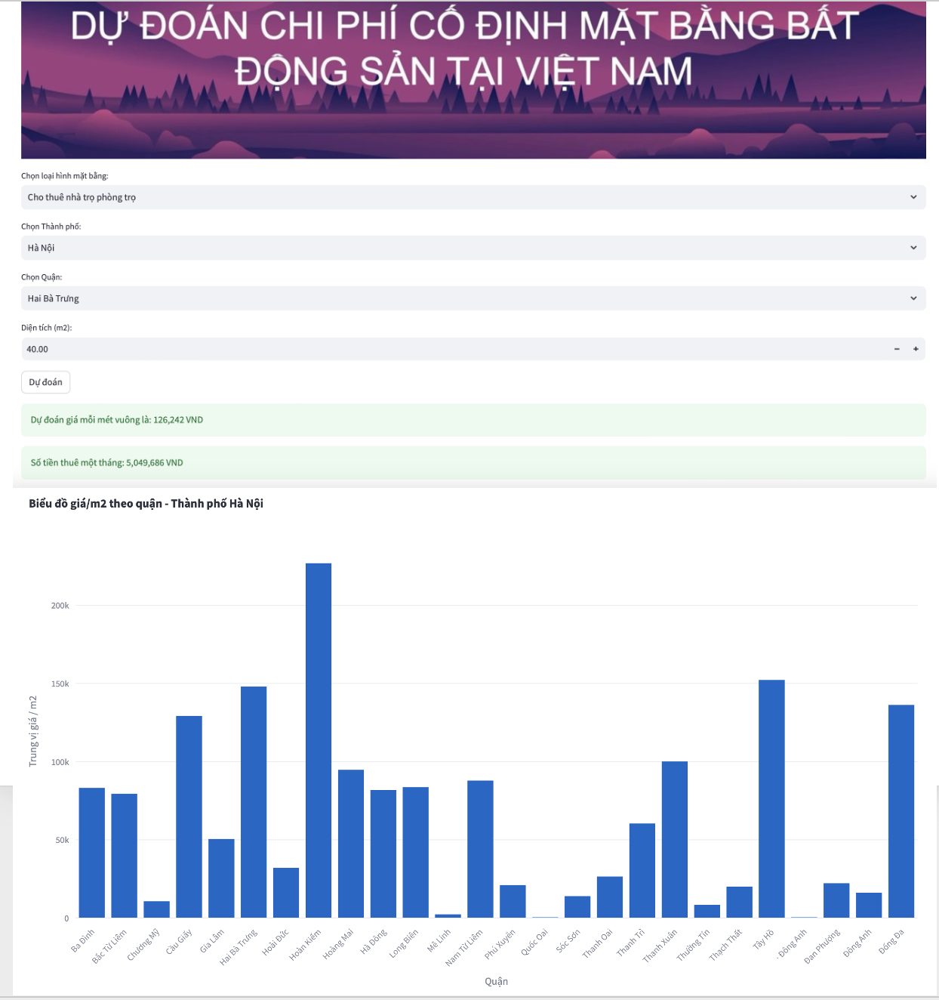

# Crawl data Bất động sản trên các trang web bds lớn phục vụ xác định chi phí thuê văn phòng/kiot/nhà của một cá nhân/nhà buôn/người kinh doanh

## Mục đích
Thư mục code này chứa các thành phần chính để thu thập dữ liệu từ các trang web bất động sản, xây dựng mô hình dự đoán giá thuê nhà / giá mua nhà / giá đất /..., và tạo một ứng dụng giao diện người dùng (GUI) để demo kết quả.
Trong thời hạn ngắn ngủi, repo này chỉ crawl tại batdongsan.com.vn, nhưng đây có thể là tiền để để mở rộng DATA CATALOG về giá cả trên thị trường bds VN, từ đó xây dựng các pipeline crawl 1-2 tuần / lần cho các mục tiêu của KV như Lending, MI.

## Kết quả
| Title | Price | Area | Location | Type |
|-------|-------|-------|-------|-------|
| Chính chủ cho thuê duplex full gỗ ngay cầu vượt Hoàng Hoa Thám gần đại học Học Viện Hàng Không. | 3,5 triệu/tháng | 28 m² | Tân Bình, Hồ Chí Minh | cho-thue-nha-tro-phong-tro |
| Phòng cho thuê ở Tô Hiến Thành, Quận 10 - Đại học Huflit - Vạn Hạnh Mall | 6,6 triệu/tháng | 28 m² | Quận 10, Hồ Chí Minh | cho-thue-nha-tro-phong-tro |

## Các File Chính

1. **crawl_bds.py**: 
   - File này chứa mã nguồn để thu thập dữ liệu từ các trang web bất động sản. Có thể có các hàm để crawl thông tin như giá, diện tích, vị trí, v.v.

2. **model_bds.py**:
   - File này chứa mã nguồn để xây dựng mô hình dự đoán. Có thể sử dụng các thuật toán máy học hoặc học sâu để dự đoán giá bất động sản dựa trên dữ liệu thu thập được.

3. **app_prediction.py**:
   - File này là ứng dụng chính có giao diện người dùng sử dụng thư viện Streamlit. Cho phép người dùng nhập dữ liệu và xem dự đoán của mô hình thông qua giao diện đơn giản.

4. **data_bds**:
   - Thư mục này chứa data được lưu về trong quá trình crawl. Nên sau này cần gộp data vào 1 file dataframe chung cho dễ xử lý

## Cách Sử Dụng

BƯỚC 1. **Thu thập Dữ liệu (crawl_bds.py)**:
   - Chắc chắn đã cài đặt các thư viện cần thiết.
   - Chạy `python crawl_bds.py` để bắt đầu quá trình thu thập dữ liệu từ các trang web bất động sản.

BƯỚC 2. **Xây Dựng Mô Hình (model_bds.py)**:
   - Chắc chắn đã cài đặt các thư viện học máy và học sâu.
   - Chạy `python model_bds.py` để xây dựng mô hình dự đoán dựa trên dữ liệu đã thu thập.
   - Lưu ý để làm được BƯỚC 2 train mô hình cần có data ở BƯỚC 1

BƯỚC 3. **Chạy Ứng Dụng Giao Diện (app_prediction.py)**:
   - Chắc chắn đã cài đặt Streamlit (`pip install streamlit`).
   - Chạy `streamlit run app_prediction.py` và mở trình duyệt tại địa chỉ được hiển thị để sử dụng ứng dụng giao diện.
   - Lưu ý để làm được BƯỚC 3 cần xong BƯỚC 1 + BƯỚC 2

## Yêu Cầu Hệ Thống
- Python 3.x
- Các thư viện được liệt kê trong `requirements.txt`

## Người đóng góp
Huydata
